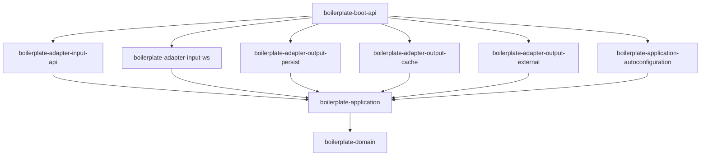
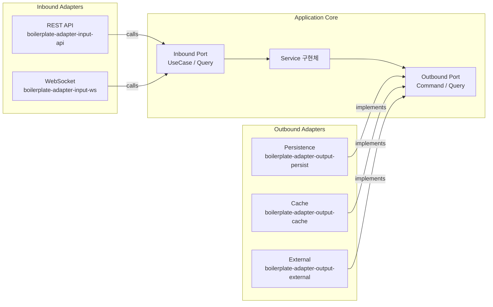

# spring-vibe-boilerplate

**Spring Boot 4 + Hexagonal Architecture 범용 보일러플레이트**

Java 25, Virtual Threads 기반의 프로덕션 레디 템플릿.
헥사고날 아키텍처(Ports & Adapters), CQRS, ArchUnit 기반 아키텍처 테스트를 내장합니다.

---

## 목차

1. [아키텍처 결정 기록 (ADR)](#아키텍처-결정-기록-adr)
2. [기술 스택](#기술-스택)
3. [모듈 구조](#모듈-구조)
4. [아키텍처](#아키텍처)
5. [빠른 시작](#빠른-시작)
6. [패키지 컨벤션](#패키지-컨벤션)
7. [새 도메인 추가 가이드](#새-도메인-추가-가이드)
8. [에러 처리](#에러-처리)
9. [관측성](#관측성)
10. [API 문서화](#api-문서화)
11. [환경 설정](#환경-설정)
12. [컨테이너화](#컨테이너화)
13. [코드 품질 도구](#코드-품질-도구)

---

## 아키텍처 결정 기록 (ADR)

| ADR | 주제 |
|-----|------|
| [ADR-0001](docs/decisions/0001-hexagonal-architecture-and-cqrs.md) | Hexagonal Architecture + CQRS 경계 분리 채택 |
| [ADR-0002](docs/decisions/0002-flat-module-structure.md) | 모듈 레이아웃: boilerplate/ 하위 플랫 구조 |
| [ADR-0003](docs/decisions/0003-package-structure-and-naming.md) | 패키지 구조 및 네이밍 컨벤션 |
| [ADR-0004](docs/decisions/0004-architecture-testing-strategy.md) | 아키텍처 테스트 전략: ArchUnit |
| [ADR-0005](docs/decisions/0005-code-quality-toolchain.md) | 코드 품질 도구 전략: Spotless + Checkstyle + ErrorProne + NullAway |
| [ADR-0006](docs/decisions/0006-ci-pipeline-strategy.md) | CI 파이프라인 전략: Lefthook + GitHub Actions + JaCoCo + OpenRewrite |
| [ADR-0007](docs/decisions/0007-error-handling-strategy.md) | 에러 처리 전략: ProblemDetail (RFC 9457) + 커스텀 ErrorCode enum |
| [ADR-0008](docs/decisions/0008-observability-strategy.md) | 관측성 전략: 구조화 로깅 + SLF4J fluent API + Actuator + OTel OTLP |
| [ADR-0009](docs/decisions/0009-api-documentation-strategy.md) | API 문서화 전략: springdoc-openapi + Redoc + Springwolf + AsyncAPI |
| [ADR-0010](docs/decisions/0010-containerization-strategy.md) | 컨테이너화 전략: bootBuildImage + 멀티스테이지 Dockerfile + docker-compose |
| [ADR-0011](docs/decisions/0011-configuration-strategy.md) | 환경 설정 전략: application-{profile}.yml 분리 + 환경변수 오버라이드 패턴 |
| [ADR-0012](docs/decisions/0012-transaction-management-strategy.md) | 트랜잭션 관리 전략: AutoConfiguration 데코레이터 패턴 |
| [ADR-0013](docs/decisions/0013-object-mapping-strategy.md) | 객체 변환 전략: 하이브리드 (MapStruct + static factory) |
| [ADR-0014](docs/decisions/0014-module-autoconfiguration-assembly-strategy.md) | 모듈 자동 조립 전략: 모듈별 AutoConfiguration 자체 등록 |
| [ADR-0015](docs/decisions/0015-multi-tenancy-strategy.md) | 멀티테넌시 전략: Row-level 테넌트 격리 (PostgreSQL RLS 기반) |
| [ADR-0016](docs/decisions/0016-authentication-strategy.md) | 인증 전략: 시나리오별 가이드 (Resource Server / Authorization Server / Custom Starter) |
| [ADR-0017](docs/decisions/0017-error-model-aip193-problemdetail.md) | 에러 모델 전략: AIP-193 에러 코드 + RFC 9457 ProblemDetail |
| [ADR-0018](docs/decisions/0018-persistence-technology-selection-guide.md) | 영속화 기술 선택 가이드: DB + ORM + Migration 조합 |
| [ADR-0019](docs/decisions/0019-cache-strategy.md) | 캐시 전략: Caffeine 기본 + Redis 확장 경로 |
| [ADR-0020](docs/decisions/0020-database-migration-strategy.md) | DB 마이그레이션 전략: Flyway 채택 |

---

## 기술 스택

| 구성 요소 | 버전 |
|----------|------|
| Java | 25 |
| Spring Boot | 4.0.5 |
| Gradle | 9.3.1 (Kotlin DSL) |
| Virtual Threads | 활성화 |

---

## 모듈 구조

9개 모듈이 `boilerplate/` 하위에 플랫 구조로 배치됩니다.

| 모듈 | 역할 | Spring |
|------|------|--------|
| `boilerplate-domain` | 순수 도메인 모델 | ✗ |
| `boilerplate-application` | Port 인터페이스 + UseCase 구현체 | ✗ |
| `boilerplate-application-autoconfiguration` | UseCase Bean 등록 | ✓ |
| `boilerplate-adapter-input-api` | REST Controller + Security | ✓ |
| `boilerplate-adapter-input-ws` | WebSocket | ✓ |
| `boilerplate-adapter-output-persist` | 영속화 (사용자 선택) | ✓ |
| `boilerplate-adapter-output-cache` | Cache | ✓ |
| `boilerplate-adapter-output-external` | 외부 API 연동 (Resilience4j) | ✓ |
| `boilerplate-boot-api` | Spring Boot 앱 (port 8080) | ✓ |

### 모듈 의존성



> adapter ↔ adapter 상호 의존 및 역방향 의존은 전면 금지입니다. ([ADR-0001](docs/decisions/0001-hexagonal-architecture-and-cqrs.md), [ADR-0002](docs/decisions/0002-flat-module-structure.md))

---

## 아키텍처

헥사고날 아키텍처(Ports & Adapters) + CQRS 경계 분리를 채택합니다.



### ArchUnit 강제 규칙

| 규칙 | 내용 |
|------|------|
| domain 순수성 | `boilerplate-domain`에 Spring/JPA 의존 금지 |
| application 순수성 | `boilerplate-application`에 Spring 의존 금지 |
| Outbound Port | `..port.output..*`는 반드시 interface |
| CQRS 경계 | Query Service → Command Outbound Port 의존 금지 |

> 상세: [ADR-0003](docs/decisions/0003-package-structure-and-naming.md), [ADR-0004](docs/decisions/0004-architecture-testing-strategy.md)

---

## 빠른 시작

### Prerequisites

- Java 25
- Docker (Testcontainers 기반 통합 테스트용)

### 명령어

```bash
# 포맷 수정 (코드 작성 후 필수)
./gradlew spotlessApply

# 전체 빌드
./gradlew build

# 아키텍처 테스트
./gradlew :boilerplate-domain:test :boilerplate-application:test

# 전체 테스트
./gradlew test

# API 서버 실행 (local 프로파일)
./gradlew :boilerplate-boot-api:bootRun
```

---

## 패키지 컨벤션

베이스 패키지: `io.github.ppzxc.boilerplate`

| 레이어 | 패키지 |
|--------|--------|
| Domain | `io.github.ppzxc.boilerplate.domain` |
| Application UseCase | `io.github.ppzxc.boilerplate.application` |
| Inbound Command Port | `io.github.ppzxc.boilerplate.application.port.input.command` |
| Inbound Query Port | `io.github.ppzxc.boilerplate.application.port.input.query` |
| Outbound Command Port | `io.github.ppzxc.boilerplate.application.port.output.command` |
| Outbound Query Port | `io.github.ppzxc.boilerplate.application.port.output.query` |
| API Adapter | `io.github.ppzxc.boilerplate.adapter.input.api` |
| WS Adapter | `io.github.ppzxc.boilerplate.adapter.input.ws` |
| Persist Adapter | `io.github.ppzxc.boilerplate.adapter.output.persist` |
| Cache Adapter | `io.github.ppzxc.boilerplate.adapter.output.cache` |

### 네이밍 규칙

| 타입 | 패턴 | 예시 |
|------|------|------|
| Inbound Command Port | `*UseCase` interface | `CreateOrderUseCase` |
| Inbound Query Port | `*Query` interface | `FindOrderQuery` |
| Outbound Port | `*Port` interface | `SaveOrderPort` |
| UseCase 구현체 | `*Service` | `CreateOrderService` |
| Controller | `*Controller` | `OrderController` |

> 상세: [`.claude/rules/coding-style.md`](.claude/rules/coding-style.md)

---

## 새 도메인 추가 가이드

1. `boilerplate-domain`에 도메인 모델 추가
2. `boilerplate-application/port/`에 Port 인터페이스 추가
3. `boilerplate-application/`에 UseCase 인터페이스 및 Service 구현체 추가
4. `ApplicationAutoConfiguration`에 UseCase Bean 등록
5. `boilerplate-adapter-output-persist`에 영속화 기술에 맞는 Adapter 추가
6. `boilerplate-adapter-input-api`에 Controller 추가

---

## 에러 처리

RFC 9457 `ProblemDetail` + 커스텀 `ErrorCode` enum을 사용합니다.

```json
{
  "type": "https://example.com/errors/not-found",
  "title": "Not Found",
  "status": 404,
  "detail": "주문 ID 123을 찾을 수 없습니다.",
  "instance": "/api/v1/orders/123",
  "errorCode": "NOT_FOUND"
}
```

- `ErrorCode` enum 위치: `io.github.ppzxc.boilerplate.domain` (boilerplate-domain 모듈)
- 예외 변환 위치: `GlobalExceptionHandler` (`@RestControllerAdvice`, boilerplate-adapter-input-api)
- domain/application 레이어는 순수 Java 예외만 사용

> 상세: [`.claude/rules/error-handling.md`](.claude/rules/error-handling.md), [ADR-0007](docs/decisions/0007-error-handling-strategy.md)

---

## 관측성

### 구조화 로깅

Spring Boot 4 네이티브 구조화 로깅(Logstash 포맷)을 사용합니다.

```java
// 올바른 사용법 (SLF4J Fluent API)
logger.atInfo()
    .addKeyValue("orderId", orderId)
    .log("주문 생성 완료");
```

### Actuator 엔드포인트

| 엔드포인트 | 접근 URL |
|-----------|---------|
| 헬스 체크 | `GET /actuator/health` |
| 메트릭 | `GET /actuator/metrics` |
| 서비스 정보 | `GET /actuator/info` |

### OpenTelemetry

환경변수 `OTLP_ENDPOINT`로 수집 백엔드를 설정합니다. 미설정 시 OTel 전송을 비활성화합니다.

> 상세: [`.claude/rules/observability.md`](.claude/rules/observability.md), [ADR-0008](docs/decisions/0008-observability-strategy.md)

---

## API 문서화

### REST API (springdoc-openapi + Redoc)

| URL | 설명 |
|-----|------|
| `/redoc.html` | Redoc UI (권장) |
| `/v3/api-docs` | OpenAPI JSON |

Swagger UI는 비활성화되어 있습니다. Redoc으로 통일합니다.

### WebSocket (Springwolf + AsyncAPI)

| URL | 설명 |
|-----|------|
| `/springwolf/asyncapi-ui.html` | AsyncAPI UI |

> 상세: [`.claude/rules/api-documentation.md`](.claude/rules/api-documentation.md), [ADR-0009](docs/decisions/0009-api-documentation-strategy.md)

---

## 환경 설정

### 프로파일 구조

| 파일 | 용도 |
|------|------|
| `application.yml` | 공통 설정 + 환경변수 플레이스홀더 |
| `application-local.yml` | 로컬 개발 |
| `application-prod.yml` | 프로덕션 (환경변수 중심, 기본값 없음) |

### 주요 환경변수

| 변수 | 설명 | 기본값 |
|------|------|--------|
| `SPRING_PROFILES_ACTIVE` | 활성 프로파일 | `local` |
| `OTLP_ENDPOINT` | OTel 수집 엔드포인트 | (선택) |

> 비밀(패스워드, 토큰)은 반드시 환경변수로 주입합니다. yml 파일에 평문 작성 금지.
> 상세: [`.claude/rules/configuration.md`](.claude/rules/configuration.md), [ADR-0011](docs/decisions/0011-configuration-strategy.md)

---

## 컨테이너화

### 이미지 빌드 (권장)

```bash
# Buildpacks 방식 (Dockerfile 불필요)
./gradlew bootBuildImage
```

### docker-compose

```bash
docker compose up -d
```

> 상세: [`.claude/rules/containerization.md`](.claude/rules/containerization.md), [ADR-0010](docs/decisions/0010-containerization-strategy.md)

---

## 코드 품질 도구

| 도구 | 실행 시점 | 역할 |
|------|----------|------|
| Spotless (Google Java Format) | 코드 작성 후 | 포맷 자동 수정 |
| Checkstyle | pre-commit / CI | 네이밍·금지 패턴 검사 |
| ErrorProne + NullAway | 컴파일 시 | 버그 패턴·Null 안전성 |
| ArchUnit | 테스트 시 | 아키텍처 규칙 강제 |
| OpenRewrite | pre-push / CI | 코드 현대화 제안 |
| Lefthook | Git Hook | 로컬 품질 게이트 |
| JaCoCo | CI | 커버리지 집계 |

```bash
# 포맷 수정
./gradlew spotlessApply

# 네이밍/구조 검사
./gradlew checkstyleMain

# 코드 현대화 미리보기
./gradlew rewriteDryRun
```

Lefthook 설치 후 `./gradlew lefthookInstall`로 Git Hook을 등록합니다.

> 상세: [`.claude/rules/ci-tools.md`](.claude/rules/ci-tools.md), [ADR-0005](docs/decisions/0005-code-quality-toolchain.md), [ADR-0006](docs/decisions/0006-ci-pipeline-strategy.md)
