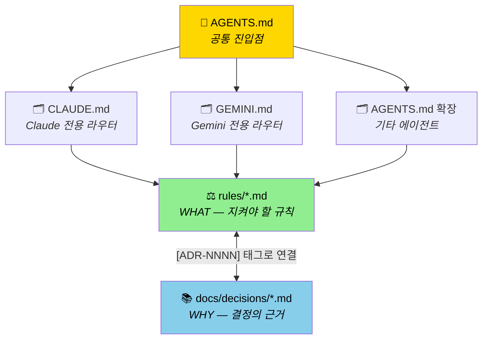
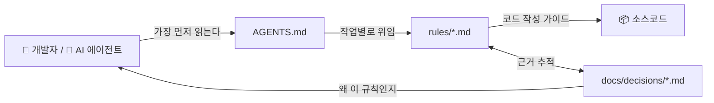
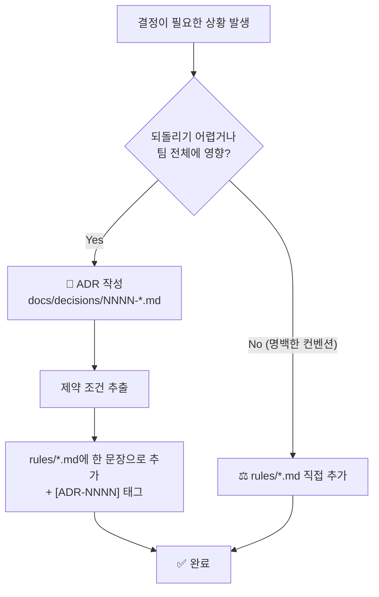
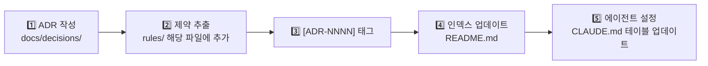

# 🧠 프로젝트 지식 관리 가이드

> AI 에이전트와 사람이 함께 협업하는 프로젝트에서
> **규칙**, **결정**, **컨텍스트**를 어떻게 관리하고 유지하는지 설명합니다.

---

## 🎯 TL;DR

이 프로젝트의 지식은 4종류의 파일로 관리됩니다.

| 파일 | 질문 | 비유 |
|------|------|------|
| `AGENTS.md` | 이 프로젝트가 무엇인가? | 📜 헌법 전문 |
| `에이전트 설정` (CLAUDE.md 등) | 어떤 작업 시 어디를 보는가? | 🗂️ 목차/색인 |
| `rules/*.md` | **무엇을** 지켜야 하는가? | ⚖️ 법조문 |
| `docs/decisions/*.md` (ADR) | **왜** 이렇게 결정했는가? | 📚 판례 |

> [!IMPORTANT]
> **ADR = WHY, rules = WHAT**
> 이 두 원칙을 기억하면 나머지는 자연스럽게 따라옵니다.

---

## 📐 전체 구조

### 파일 관계도



### 정보 흐름



---

## 📂 각 파일의 역할

### 📜 AGENTS.md — 헌법 (공통 진입점)

모든 AI 에이전트(Claude, Gemini, Copilot 등)가 **가장 먼저 읽는** 단일 소스입니다.
특정 AI 도구에 종속되지 않는 범용 포맷으로 작성합니다.

**포함해야 할 것**
- 프로젝트 한 줄 설명
- 모듈/디렉토리 구조 요약
- 자주 쓰는 명령어 (Quick Commands)
- 핵심 아키텍처 원칙 (3~5개)
- 상세 규칙 파일 목록으로의 링크

**포함하지 말 것**
- 세부 구현 규칙 (→ `rules/`에 위임)
- 특정 AI 도구에만 적용되는 설정
- 자주 바뀌는 상세 정보

---

### 🗂️ 에이전트별 설정 파일 (CLAUDE.md, GEMINI.md 등) — 목차

"어떤 작업을 할 때 어떤 규칙 파일을 읽어야 하는가"를 알려주는 **라우터** 역할입니다.

**작성 원칙**
- **짧게 유지** (50줄 이하 권장)
- 세부 규칙은 직접 쓰지 않고 `rules/` 파일로 위임
- 작업 → 규칙 파일 매핑 테이블 형태로 작성

**예시 형태**

```markdown
| 작업 | 읽을 파일 |
|------|----------|
| 아키텍처 변경 | rules/architecture.md |
| 테스트 작성 | rules/testing.md |
| 에러 처리 | rules/error-handling.md |
```

> [!TIP]
> AGENTS.md를 `@../AGENTS.md` 형태로 참조(include)하면
> 공통 내용을 중복 작성하지 않아도 됩니다.

---

### ⚖️ rules/*.md — 법조문 (WHAT)

**"무엇을 지켜야 하는가"만** 기술합니다.
구현 방법이 아닌, 지켜야 할 **원칙과 제약**만 담습니다.

#### 작성 형식

```
~할 것 [ADR-NNNN]
~금지 [ADR-NNNN]
```

`[ADR-NNNN]` 태그는 "왜 이 규칙이 존재하는가"를 추적할 수 있게 해줍니다.

#### ✅ 허용 vs ❌ 금지

| ✅ 이렇게 작성하세요 | ❌ 이건 쓰지 마세요 |
|---------------------|---------------------|
| `adapter 레이어에서 ProblemDetail로 예외를 변환할 것` | `GlobalExceptionHandler 클래스를 만들고 @RestControllerAdvice를 붙인다` |
| `domain 레이어에서 Spring 의존 금지` | `@Service, @Component, @Repository 사용 금지 (구체적 어노테이션 나열)` |
| `외부 API 호출 시 타임아웃을 설정할 것` | `HttpClient.timeout(Duration.ofSeconds(5)) 코드 예시 삽입` |
| `비밀 정보는 환경변수로 주입할 것` | `application.yml에 DB_PASSWORD: ${DB_PASSWORD} 와 같이 작성한다` |

> [!NOTE]
> rules는 **스켈레톤 가드레일**입니다.
> AI 에이전트가 매번 코드를 어떻게 작성할지 알려주는 게 아니라,
> "이것만은 하지 마라 / 이렇게 해야 한다"는 경계선을 긋는 것입니다.

#### 크기 관리

- 파일 하나당 **100줄 이하** 유지
- 100줄 초과 시 주제별로 분리
  - 예: `testing.md` → `testing-unit.md`, `testing-integration.md`

---

### 📚 docs/decisions/*.md — 판례 (WHY)

"왜 이렇게 결정했는가"를 보존합니다.
**MADR 4.0** 형식을 사용합니다.

#### 언제 ADR을 작성하는가

| 작성 ✅ | 작성 ❌ |
|--------|---------|
| 기술 스택 선택 (DB, 프레임워크, 언어) | 특정 클래스 구현 방식 |
| 아키텍처 패턴 채택 | 변수명, 메서드명 선택 |
| 팀 규칙 변경 (코드 포맷, 테스트 전략) | 일반적인 버그 수정 |
| 외부 서비스 연동 방식 결정 | 기존 ADR로 이미 커버되는 결정 |
| 보안/규정 준수 결정 | 리팩토링 (동일 패턴 유지 시) |

> [!TIP]
> **판단 기준:** "6개월 후 이 결정을 왜 했는지 기억할 수 없을 것 같다" → ADR 작성

#### 필수 구성 요소

```markdown
---
status: accepted          # accepted | deprecated | superseded by ADR-NNNN
date: YYYY-MM-DD
decision-makers: 이름
---

# 제목

## Context and Problem Statement
왜 결정이 필요했는가 (2~3문장)

## Considered Options
* Option A
* Option B        ← 반드시 2개 이상

## Decision Outcome
Chosen option: "A", because ...

### Consequences
* Good, because ...
* Bad, because ...
```

#### 번호 체계

- 파일명: `NNNN-kebab-case-title.md`
- 번호는 현재 최대값 + 1
- `docs/decisions/README.md`에 한 줄 요약 등록 필수

---

## 🔄 WHY ↔ WHAT 동기화

ADR과 rules는 **양방향으로 연결**되어야 합니다.

### 동기화 흐름



### 핵심 원칙

```
ADR  → 근거(WHY)를 보존한다
rules → 제약(WHAT)만 추출한다
```

ADR에 있는 "왜 이렇게 결정했는가"를 그대로 rules에 복사하지 않습니다.
rules에는 **한 줄 제약**만 남기고, 자세한 이유는 ADR에서 읽도록 `[ADR-NNNN]` 태그로 연결합니다.

---

## 🛠️ 워크플로우

### 새 아키텍처 결정 시



### 단순 컨벤션 추가 시

rules 해당 파일에 직접 추가합니다. ADR 불필요.
단, 나중에 "왜 이 규칙이 생겼지?"라고 물어볼 것 같다면 ADR을 작성합니다.

### 기존 결정 폐기 시

1. ADR의 `status`를 `deprecated` 또는 `superseded by ADR-NNNN`으로 변경
2. rules에서 해당 `[ADR-NNNN]` 태그가 붙은 규칙 삭제 또는 수정
3. `docs/decisions/README.md` 인덱스 업데이트

---

## 🧹 유지보수 체크리스트

| 상황 | 대응 |
|------|------|
| 같은 규칙이 두 파일에 중복 | 한 파일로 통합, 나머지에서 참조 |
| 규칙이 서로 모순 | ADR 작성 후 한쪽 삭제 |
| 6개월 이상 참조되지 않은 규칙 | 삭제 또는 `docs/decisions/`로 이동 |
| 규칙이 현재 코드와 불일치 | 코드 또는 규칙 중 하나를 맞춤 |
| rules 파일이 100줄 초과 | 주제별로 분리 |
| ADR 추가 후 rules 미업데이트 | rules 동기화 + `[ADR-NNNN]` 태그 추가 |
| rules 추가 후 CLAUDE.md 미업데이트 | 에이전트 설정 파일의 라우팅 테이블 업데이트 |

---

## ⚠️ 안티패턴

> [!WARNING]
> **rules에 구현 디테일 쓰기**
> 클래스명, 어노테이션명, 코드 예시를 rules에 넣으면 구현이 바뀔 때마다 rules를 수정해야 합니다.
> rules는 "무엇을"이지 "어떻게"가 아닙니다.

> [!WARNING]
> **ADR 없이 비자명한 제약 추가**
> "왜 이 규칙이 생겼지?"라고 묻게 되는 규칙을 근거 없이 추가하면
> 나중에 아무도 건드리지 못하는 "신성한 소" 규칙이 됩니다.

> [!WARNING]
> **CLAUDE.md에 세부 규칙 직접 작성**
> 에이전트 설정 파일이 길어지면 AI가 중요한 내용을 놓칩니다.
> 세부 규칙은 반드시 `rules/`에 위임하세요.

> [!WARNING]
> **ADR 작성 후 rules 동기화 누락**
> ADR에만 결정을 기록하고 rules에 반영하지 않으면
> AI 에이전트는 그 결정을 모른 채 코드를 생성합니다.

> [!WARNING]
> **rules 파일 추가 후 에이전트 설정 미업데이트**
> 아무리 좋은 규칙을 써도 에이전트가 그 파일의 존재를 모르면 읽지 않습니다.

---

## 💡 FAQ

<details>
<summary><b>ADR과 주석(comment)의 차이는 무엇인가요?</b></summary>

주석은 코드의 **HOW**를 설명하고, ADR은 코드 전반에 영향을 미치는 **WHY**를 보존합니다.
"왜 이 클래스를 이렇게 짰는가"는 주석이고,
"왜 이 아키텍처 패턴을 선택했는가"는 ADR입니다.

</details>

<details>
<summary><b>규칙(rules)이 너무 많아지면 어떻게 하나요?</b></summary>

파일당 100줄 이하를 유지하는 것이 기준입니다.
초과하면 주제별로 파일을 분리하세요.
예: `testing.md` → `testing-unit.md` + `testing-integration.md`

에이전트 설정 파일의 라우팅 테이블도 함께 업데이트해야 합니다.

</details>

<details>
<summary><b>팀원이 ADR을 읽지 않으면 의미가 없지 않나요?</b></summary>

ADR의 주요 독자는 두 가지입니다:
1. **미래의 팀원 (또는 미래의 자신)** — "왜 이런 구조가 됐지?"를 물어볼 때
2. **AI 에이전트** — context-map 생성 시 ADR을 읽고 결정 히스토리를 파악

두 번째 독자 때문에 ADR은 코드 기여자 수와 무관하게 가치가 있습니다.

</details>

<details>
<summary><b>ADR을 수정해도 되나요?</b></summary>

ADR은 **불변 기록**이 원칙입니다.
결정이 바뀌면 기존 ADR의 `status`를 `superseded by ADR-NNNN`으로 변경하고,
새로운 ADR을 별도로 작성합니다.
기존 ADR을 직접 수정하면 "왜 바뀌었는가"의 히스토리가 사라집니다.

</details>

<details>
<summary><b>AGENTS.md와 CLAUDE.md의 경계는 어디인가요?</b></summary>

- **AGENTS.md**: 어떤 AI 도구를 사용하든 공통으로 적용되는 내용. 프로젝트 개요, 모듈 구조, 핵심 원칙.
- **CLAUDE.md**: Claude Code에만 해당하는 내용. 주로 "어떤 작업 시 어떤 rules 파일을 읽을지" 라우팅 테이블.

두 파일이 중복되면 AGENTS.md를 정본으로 하고 CLAUDE.md에서 `@../AGENTS.md`로 참조합니다.

</details>

---

## 📎 관련 파일

| 파일 | 역할 |
|------|------|
| `AGENTS.md` | 프로젝트 공통 진입점 |
| `.claude/CLAUDE.md` | Claude 전용 라우터 |
| `.claude/rules/rules-maintenance.md` | 규칙 파일 작성/유지 방법 |
| `docs/decisions/README.md` | ADR 인덱스 |
| `docs/decisions/0000-template.md` | ADR full 템플릿 |
| `docs/decisions/0000-template-minimal.md` | ADR minimal 템플릿 |
